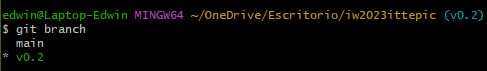
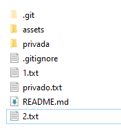

--crear repositorio

--Clonar local

#git clone https://github.com/edramontoyava/iw2023ittepic.git

--Anadir readme.md

echo "# iw2023ittepic" >> README.md

--commit

git commit -m "Initial commit"

git branch -M main

git push -u origin main

--gitignore

touch .gitignore

--Tag

git tag -a v0.1 -m 'v0.1'

--foto

--autenticacion

--Companeros

--estrellas

--tabla

Nombre             |Github 
-------------------|-----------------|
Bryan              |PaulRazon        | 
Andres             |andrestian01     |
Victor             |XxXelbichoXxX    |

--colaborador

--crear rama

git branch 'v0.2'

--Posicionarse sobre la nueva rama 

git checkout 'v0.2'

--2.txt

--subir cambios